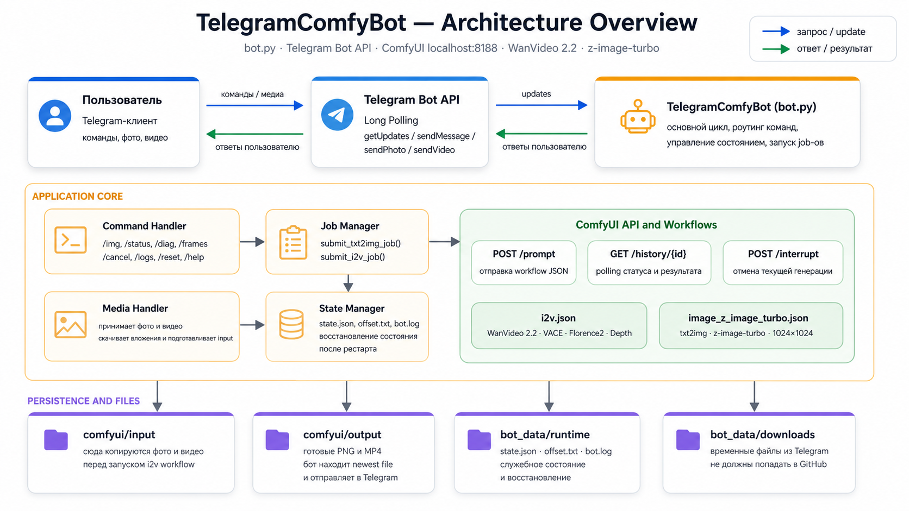

# 🤖 Telegram Bot — Локальная генерация фото и видео через ComfyUI

[](https://python.org)
[](https://pypi.org/project/requests/)
[](https://github.com/comfyanonymous/ComfyUI)
[](start_bot.bat)
[](LICENSE)

---

## 📋 О проекте

Telegram-бот, который принимает команды в чате и запускает **локальную генерацию изображений и видео** через ComfyUI — без внешних API и без отправки данных на сторонние серверы.

Поддерживает два режима:

- **txt2img** — генерация изображения по текстовому промпту через модель `z-image-turbo` (Lumina2 + Qwen CLIP + AuraFlow KSampler)
- **i2v (Image-to-Video)** — анимация изображения по видео-референсу через **WanVideo 2.2** с VACE-модулем, DepthAnything V2, Florence2 и LoRA-стилизацией

Бот также показывает **температуру CPU и GPU в реальном времени** — удобно при долгих генерациях на локальном железе.

---

## ⚙️ Возможности

- 🖼️ **txt2img** — `/img <промпт>` → генерация фото через z-image-turbo (1024×1024)
- 🎬 **i2v** — отправить фото + видео → анимация через WanVideo 2.2 VACE + DepthAnything V2
- 🌡️ **Мониторинг** — `/stats`: температура CPU (WMI/PowerShell) и GPU (pynvml / nvidia-smi)
- 📊 **Диагностика** — `/diag`: статус ComfyUI, размер очереди, свободное место на диске
- 📋 **Логи** — `/logs`: последние 40 строк лога прямо в Telegram
- ⛔ **Отмена** — `/cancel`: прерывает текущую генерацию через ComfyUI `/interrupt`
- 🔒 **Whitelist** — бот отвечает только одному `allowed_chat_id` из конфига
- 💾 **Персистентное состояние** — `state.json` сохраняет pending-медиа и текущую задачу между перезапусками

---

## 🏗️ Архитектура



```
Пользователь
    │
    ▼ команды / медиа
Telegram Bot API  (Long Polling)
    │
    ▼ updates
TelegramComfyBot (bot.py)
 ├── Command Handler    — /img /status /diag /logs /cancel /reset /frames
 ├── Media Handler      — фото + видео → .botdata/downloads/ → comfyui/input/
 ├── Job Manager        — submit_i2v_job() / submit_txt2img_job()
 ├── State Manager      — state.json, offset.txt, bot.log
 └── GPU/CPU Monitor    — pynvml → nvidia-smi → WMI fallback
    │
    ├──► POST /prompt   →  ComfyUI (localhost:8188)
    │       workflow JSON + client_id → prompt_id
    │
    ├──► GET /history/{prompt_id}   (polling каждые poll_interval сек)
    │       ← filename результата
    │
    └──► scan comfyui/output/  →  send_video / send_photo → Telegram
```

---

## 🧠 Модели и пайплайны

### txt2img — `image_z_image_turbo.json`

| Компонент | Модель |
|-----------|--------|
| Диффузионная модель | `z-image-turbo-bf16.safetensors` |
| CLIP | `qwen3-4b.safetensors` (Lumina2) |
| VAE | `ae.safetensors` |
| Семплер | `resmultistep`, 8 шагов, CFG 1 |
| Разрешение | 1024×1024 |

### i2v — `i2v.json`

| Компонент | Модель |
|-----------|--------|
| Основная модель | `Wan2.2-2.2t2v-highnoise-14B-fp8-scaled.safetensors` |
| Вторая стадия | `Wan2.2-2.2t2v-lownoise-14B-fp8-scaled.safetensors` |
| VAE | `Wan21VAE-bf16.safetensors` |
| T5 Text Encoder | `umt5-xxl-enc-bf16.safetensors` (fp8e4m3fn) |
| VACE модуль | `Wan22FunVACEmoduleA14B-{LOW/HIGH}-fp8...safetensors` |
| LoRA | `lightx2v-T2V-14B-...v2-lora-rank64-bf16.safetensors` |
| Depth | `depth_anything_v2_vitl.pth` |
| Captioning | `Florence-2-large` (fp16, sdpa) |
| Семплер | `unipc`, 8 шагов (split: 91+остаток), CFG schedule `3.5→3→1→1` |
| Разрешение | 432×768 (по умолчанию) |
| Кадры | 150 (настраивается через `/frames N`) |
| Внимание | `sageattn` |

---

## 🗂️ Структура проекта

```
telegram-comfy-bot/
├── bot.py                        # Основная логика бота
├── bot_test.py                   # Версия с тестами / отладкой
├── config.json                   # Конфиг (не коммитить — токен!)
├── config.json.example           # Шаблон конфига
├── requirements.txt              # Зависимости Python
├── start_bot.bat                 # Запуск на Windows
├── workflows/
│   ├── image_z_image_turbo.json  # Пайплайн txt2img
│   └── i2v.json                  # Пайплайн Image-to-Video
└── assets/
    └── architecture.svg          # Схема архитектуры
```

---

## 🚀 Установка и запуск

### Требования

- Python 3.10+
- ComfyUI запущен локально (`python main.py --listen`)
- Все модели из таблицы выше загружены в ComfyUI
- Windows (для `start_bot.bat`) или Linux/macOS (через команду ниже)

### 1. Клонировать репозиторий

```bash
git clone https://github.com/YOUR_USERNAME/comfyui-telegram-bot.git
cd comfyui-telegram-bot
```

### 2. Создать виртуальное окружение и установить зависимости

```bash
python -m venv venv
source venv/bin/activate        # Linux/macOS
# или: venv\Scripts\activate    # Windows

pip install -r requirements.txt
```

### 3. Создать конфиг

```bash
cp config.json.example config.json
```

Заполнить `config.json`:

```json
{
  "telegram": {
    "bot_token": "YOUR_BOT_TOKEN",
    "allowed_chat_id": "YOUR_CHAT_ID"
  },
  "comfyui_base_url": "http://127.0.0.1:8188",
  "comfyui_input_dir": "C:/ComfyUI/input",
  "comfyui_output_dir": "C:/ComfyUI/output",
  "workflow_api_json": "./workflows/i2v.json",
  "txt2img_workflow_api_json": "./workflows/image_z_image_turbo.json",
  "photo_node_id": "116",
  "video_node_id": "141",
  "txt2img_prompt_node_id": "5727",
  "poll_timeout_seconds": 25,
  "status_poll_interval_seconds": 5,
  "min_free_disk_gb": 10,
  "frames_default": 150
}
```

### 4. Запустить

**Windows (быстро):**
```bat
start_bot.bat
```

**Любая ОС:**
```bash
python bot.py config.json
```

---

## 🤖 Команды бота

| Команда | Описание |
|---------|----------|
| `/start` | Приветствие и список команд |
| `/img <промпт>` | Генерировать изображение (txt2img) |
| `[фото] + [видео]` | Загрузить медиа для i2v |
| `/frames N` | Установить количество кадров (1–10000) |
| `/status` | Текущий статус задачи |
| `/diag` | Диагностика: ComfyUI, диск, очередь |
| `/stats` | Температура CPU и GPU |
| `/logs` | Последние 40 строк лога |
| `/cancel` | Прервать текущую генерацию |
| `/reset` | Сбросить pending-медиа |
| `/sendtest` | Отправить последний файл из output/ |
| `/help` | Справка |

### Сценарий i2v

1. Отправить фото (портрет)
2. Отправить видео (движение-референс)
3. Бот автоматически запускает `submit_i2v_job()`
4. Florence2 генерирует caption → стиль-промпт → WanVideo VACE
5. Результат (`.mp4`) приходит в чат

---

## 🌡️ Мониторинг GPU/CPU

Поддерживаемые методы (в порядке приоритета):

| Метод | Платформа | Что показывает |
|-------|-----------|----------------|
| `pynvml` | Linux / Windows | Температура GPU, VRAM (used/total) |
| `nvidia-smi` | Linux / Windows | Температура GPU, VRAM |
| WMI (PowerShell) | Windows | Температура CPU через ACPI / LibreHardwareMonitor |

Установить `pynvml` для полного мониторинга NVIDIA:
```bash
pip install nvidia-ml-py3
```

---

## 📦 Зависимости

```
requests==2.31.0
```

> `pynvml` — опционально, для мониторинга GPU через Python API.  
> Все остальные зависимости (`json`, `os`, `shutil`, `subprocess`, `uuid`, `time`) — стандартная библиотека Python.

---

## ⚠️ Безопасность

- `config.json` содержит токен бота — **не коммитить** в репозиторий
- Файл уже добавлен в `.gitignore`
- Бот принимает команды только от одного `allowed_chat_id`
- Используй `config.json.example` как шаблон для других пользователей

---

## 📄 Лицензия

MIT License. Свободно использовать и модифицировать.

---

## 💬 Контакт

Telegram: **@djkzn**  
GitHub: **github.com/djkzn**
